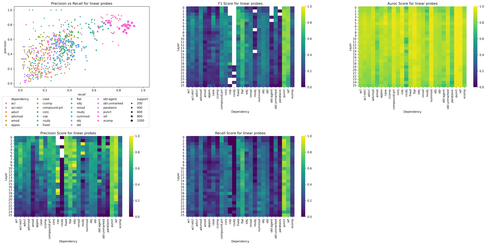
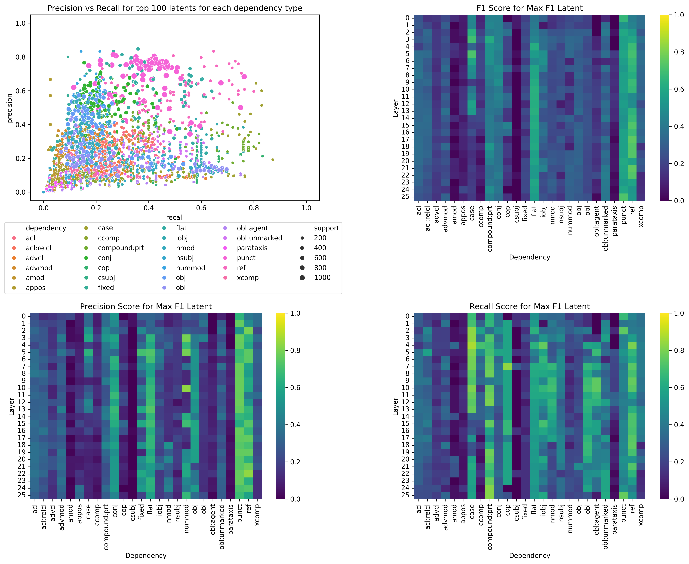
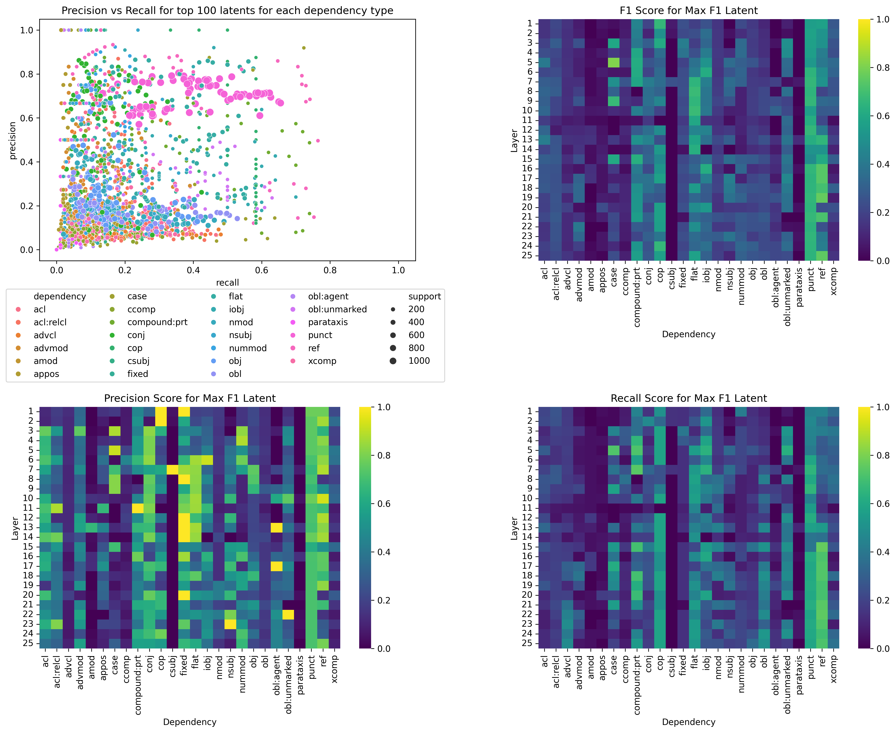
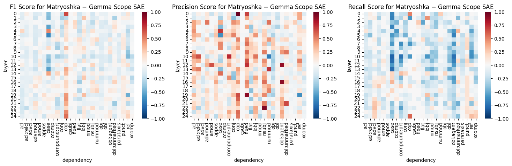
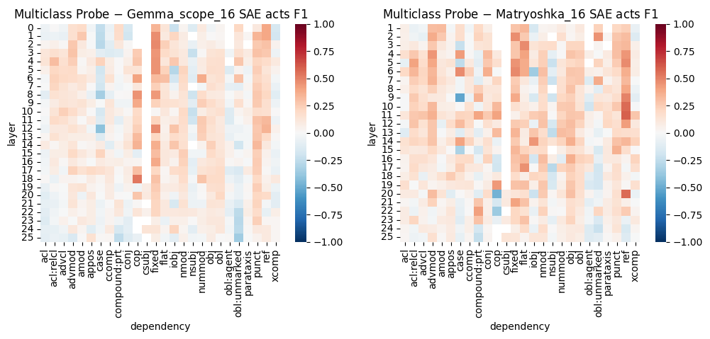
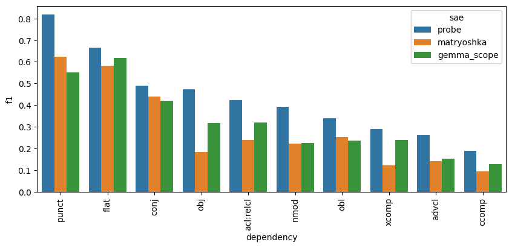
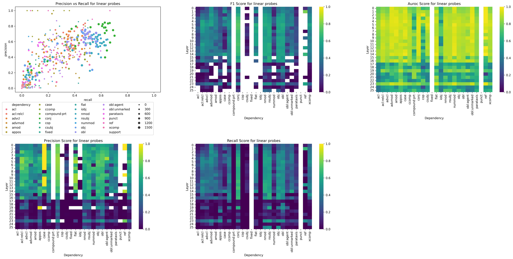
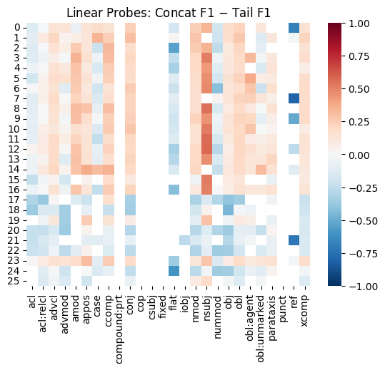

# SAE latents and linguistic representation

*Epistemic status: Incomplete and speculative.*

## Background

Sparse autoencoders (SAEs; Bricken et al., 2023; Templeton et al., 2024) have emerged as a powerful tool for probing the representations learned by large language models (LLMs) by decomposing model activations (in the residual stream and elsewhere) into their constituent latent *features*. Such features sometimes elucidate hidden, low-dimensional structure in the LLM residual stream, as in the case of days of the week forming a ring in a two-dimensional linear subspace (Engels et al., 2024). Canonically, human languages form hierarchical, tree-like syntactic structures (Chomsky, 1957) to achieve relational composition (Wattenberg & Viégas, 2024), and classic work in NLP using "structural probes" has demonstrated that LLMs embed this structure in a low-dimensional subspace (Hewitt & Manning, 2019; White et al., 2021; Diego-Simón et al., 2024).

However, structural probes (and similar) depend on comparing token embeddings at multiple token positions simultaneously, e.g. through a subtraction or cosine similarity computation. Even simpler techniques, such as "edge probing" (Tenney et al., 2019a; 2019b), also rely on aggregating information across token positions. Thus, it is unclear whether syntactic information is readily available at a single token position. This is notable because to date, all SAE architectures operate on each token position independently, and might be missing information encoded in these structured relationships. Here, we report that both linear probes and SAE latents fail to robustly identify syntactic relationships when provided only single token representations --- even when those relationships are formed with prior tokens to which causal attention grants access. This raises the possibility that novel SAE architectures that combine information across tokens (nostalgebraist, 2024) or traditional SAEs trained on token differences (Wattenberg & Viégas, 2024) might better capture the rich structure of residual stream representations, and thus the features used by LLMs.

## Experimental Setup

To study the representation of syntax in LLMs, we used the Universal Dependencies (UD) annotations (Nivre et al., 2017) of the [UD_English-EWT dataset](https://github.com/UniversalDependencies/UD_English-EWT) (Silveira et al., 2014). [UD](https://universaldependencies.org/) is a framework for consistent annotation of grammar (including syntactic dependencies) across different human languages. Briefly, each (tail) word in a sentence is assigned one or more UD types, as well as one (head) word for each UD type. We can think of this as defining a labeled, directed acyclic graph for each sentence, where the labels are UD types and edges point from head to tail. Example UD types include `advmod` (adverbial modifier), `amod` (adjectival modifiers), `conj` (conjunct), `csubj` (clausal subject), `iobj` (indirect object), `nmod` (nominal modifier), `nsubj` (nominal subject), `obj` (object) and `punct` (punctuation). This is more challenging than part of speech (POS) tagging, as the same POS can take on any number of UD types (e.g. a noun might be a `csubj`, `iobj`, `nmod`, `nsubj`, `obj` or something else entirely).

We focus on Google's [Gemma-2-2B model](https://huggingface.co/google/gemma-2-2b).
We first train linear probes with a binary cross-entropy (multilabel) loss to predict UD type(s) based on tail contextualized token embeddings. We consider only UD types that appear at least 20 times in the test set (of which there were 26 unique UD types), and we then further filter for instances where the *tail* comes after the *head* to which it refers. This latter constraint ensures that in principle, the attention mechanism could move the relevant information to the tail position, allowing for high classification performance.

We then evaluate [pre-trained JumpReLU SAEs (GemmaScope)](https://www.neuronpedia.org/gemma-scope#main) (Lieberum et al., 2024) and Matryoshka SAEs (Bussman et al., 2024) on the same dataset. Thresholding SAE latents at zero allows us to treat them as classifiers for each UD type. In each layer, we identified the latent with the highest F1 score on the training set for each UD, and then plotted its F1, precision, and recall on the test set for an unbiased estimate of performance.

In all cases, we evaluate performance using the F1 score for each UD type independently, as
$$ F1 = 2 * \frac{precision * recall}{precision + recall}$$

Previous papers using edge probing (Tenney et al., 2019a) report F1 scores above 0.9 for most UDs; polar probes achieve comparably high balanced accuracy (Diego-Simón et al., 2024).

## Results

### Poor precision/recall for single token positions

The figure below shows the precision, recall, F1, and auROC scores for linear probes trained on all 26 layers of Gemma-2-2B and 26 UD types. With the exception of a small handful of UD types (e.g. punctuation), F1 scores are quite low, generally below 0.5. This indicates limited ability to decode UD from the tail position alone.

Precision, recall and F1 for GemmaScope (*top*) and Matryoshka (*bottom*) appear similar; F1 scores rarely exceed 0.5.

The one exception is that Matryoshka SAEs are slightly biased in favor of higher precision, at the expense of lower recall.

### Classifier comparisons

Linear probes are a challenging baseline which SAEs often fail to meet (Kantamneni et al., 2025). We therefore compared F1 scores for linear probes, GemmaScope, and Matryoshka SAEs across all layers and UDs. Linear probes outperformed both SAEs for the large majority of classes tested.

Picking layer 12 arbitrarily and selecting the 10 most frequent UDs, we can get a better sense of the low performance of the linear probes, and the extent to which the SAEs fall short of this baseline.

## Conclusion and Future Directions

The present results suggest that tree-like syntactic structures are not recoverable from single token positions in LLMs. This is in some sense quite surprising: the next token is generated purely on the basis of the previous token's hidden embedding, and one might predict that syntactic properties such as `iobj` ("indirect object-ness") or `nsubj` ("nominal subject-ness") would come to be represented explicitly, rather than simply in the relationships between tokens. We can think of several hypotheses:

1. Perhaps classical linguistic categories such as `nsubj` and `iobj` are just not used by transformers in practice (Wu et al., 2020; Rogers et al., 2020). We view this as unlikely, given the structural probing results (Hewitt & Manning, 2019; Diego-Simón et al., 2024), but supervised probes can reveal the existence of information that is not causally relevant for computation.

2. These properties are represented in MLP layers or attention heads, where we did not probe, and then erased or formatted differently before reconverging in the residual stream. However, previous attempts to recover UDs from attention heads have been unsuccessful (Htut et al., 2019).

3. These properties are encoded, but not at the relevant token position in a manner that makes them easy to probe for. For example, perhaps they are all represented in their own subspaces at the final token position. This would require some kind of binding mechanism (Feng & Steinhardt, 2023) to associate properties with their referents.

In any case, we think that the fact that such information is not recoverable from single token positions represents a fundamental limitation for the modern incarnation of SAEs.

#### Caveats and limitations

This work did not reproduce earlier claims of structural/edge/polar probes. We did attempt a conceptual replication by concatenating the contextual token embeddings of the head and tail tokens as input to our linear probe, achieving somewhat better F1 scores (at the cost of some probe degeneracy). We expect this is a bug, but we have not resolved it thus far. Our tail probing results should be interpreted with this caveat in mind.

## Reproduction

Interested readers are invited to clone this repo. All figures can be reproduced from `main.py`.

## Acknowledgements

This work benefited from helpful discussions with [Kola Ayonrinde](https://github.com/koayon), [Jacob Drori](https://github.com/jacobcd52), and [Jake Ward](https://github.com/jnward), organized through [AISC](https://www.aisafety.camp/). Funding support was provided to A. Lowet by Open Philanthropy.
