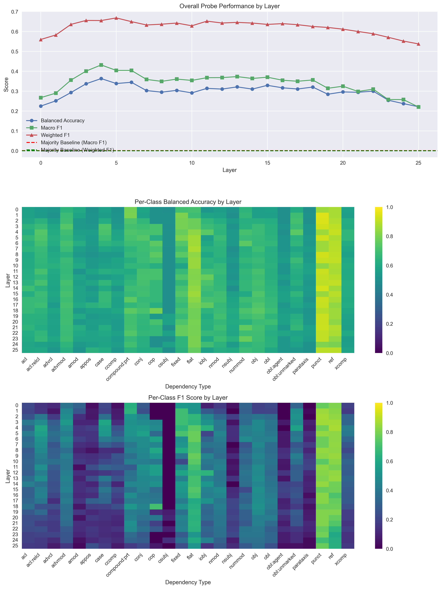

# Densely-activating SAE latents and linguistic features

This work is actively being developed, and the latest commit might not be the most recent stable version. Please check back periodically for updates.

## Background

Sparse autoencoders (SAEs; Bricken et al., 2023; Templeton et al., 2024) have emerged as a powerful tool for probing the representations learned by large language models (LLMs) by decomposing model activations (in the residual stream and elsewhere) into their constituent latent *features*. Such linguistic features are assumed to be *sparse*, leading to "superposition" — the tendency for models to represent more features than they have dimensions (Elhage et al., 2022). However, SAEs struggle to capture features with different levels of abstraction, and it is often not clear how to best select the number of SAE latents to use (Bussmann et al., 2024). Empirically, it is also the case that certain SAE latents are sometimes active on a very high fraction (> 5%) of tokens ("activation density"), especially in JumpReLU (Rajamanoharan et al., 2024) and TopK (Gao et al., 2024) SAEs, which runs counter to the sparse feature intuition (Nanda, 2025).

This repo makes several contributions to this literature surrounding SAEs, focusing on Google's [Gemma-2-2B model](https://huggingface.co/google/gemma-2-2b). First, we show that a subset of densely-activating latents correspond to highly structured linguistic features. Such latents are often misinterpreted by existing autointerp pipelines (e.g. [Neuronpedia's Gemma Scope](https://www.neuronpedia.org/gemma-scope#main) (Lieberum et al., 2024) and to our knowledge, have not been previously reported. However, more recent autointerp prompting methods (e.g. Juang et al., 2024) with SOTA models show better results interpreting these latents.

<!-- 2. We show that [Matryoshka SAEs](https://github.com/bartbussmann/matryoshka_sae) (Bussmann et al., 2024; Nabeshima, 2024) better isolate these linguistic features. More specifically,latents with high cosine similarity to linguistic features are even more likely to be densely-activating in these Matryoshka SAEs, compared to "vanilla" JumpReLU SAEs. Conversely, there are fewer "uninterpretable" densely-activating latents in Matryoshka SAEs. -->

## Locating universal dependencies (UD) in SAE latents

When browsing the [Neuronpedia](https://www.neuronpedia.org/gemma-scope#main) dashboards of densely-activating latents, we noticed that while many latents were difficult for humans to interpret, a subset appeared to correspond quite well with linguistic features (based on their max-activating tokens), despite being mislabeled by Neuronpedia's autointerp description. For example, [here's](https://www.neuronpedia.org/gemma-2-2b/5-gemmascope-res-16k/11910?embed=true&embedexplanation=true&embedplots=true&embedtest=true) a latent that activates on over 5% of tokens, and which seems to fire selectively on adjectives:

To study this phenomenon in a more structured way, we first trained linear probes for Universal Dependencies based on the [UD_English-EWT dataset](https://github.com/UniversalDependencies/UD_English-EWT). [Universal Dependencies](https://universaldependencies.org/) is a framework for consistent annotation of grammar (including syntactic dependencies) across different human languages. These dependencies are in some sense the most basic elements from which more elaborate relational composition (Wattenberg & Viégas, 2024) can be realized. Classic work in NLP has demonstrated that transformers are able to not only learn these dependencies (Tenney et al., 2019a, 2019b), but also assemble them into more structured, low-dimensional representations (Hewitt & Manning, 2019; Diego-Simón et al., 2024). Our probes (linear layers trained with a binary cross-entropy loss on multi-class classification for the 26 dependencies with at least 20 occurrences in the training set) replicate these earlier findings.

Next, we computed the cosine similarity between these probe weights and the pre-trained Gemma Scope JumpReLU SAE latents (width 16k) and computed the max cosine similarity for each relation type. We then compared this to the distribution of max cosine similarity values for randomly permuted SAE encoder/decoder weights and found highly significant degrees of alignment for most dependencies.

One interesting finding was that max cosine similarities were often higher --- and sometimes significantly so --- for the decoder rather than the encoder weights (rightmost column). This is perhaps surprising since encoders are often thought of as "detecting" features and decoders are often thought of as "representing" features (Nanda, 2023), and our linear probes were optimized for detection. We don't have a great theoretical understanding at present for why the decoders should align better, but this appears reasonably robust across transformer architectures, at least for intermediate transformer layers.

## Aside: Unleared dependencies

Certain dependencies, such as `csubj` (clausal subject), don't appear to be linearly represented in the residual stream at all, at least in Gemma-2B. (This relation is used when the subject of a verb is a clause rather than a noun or pronoun, in which case `nsubj`, or nominal subject, would apply).

More interestingly, other dependencies (e.g. `cop` (copula)) are hardly learned by the SAE at any layer, *despite being linearly decodable from the (intermediate layers of) residual stream activations themselves*. Copulas are linking verbs that connect the subject to a predicate without contributing additional meaning beyond tense, agreement or modality. In English, this is typically a form of "to be" and appears to operate just like any other verb (e.g., "She **is** a doctor"). However, other languages, such as Mandarin, Russian, or Hebrew, drop the copula entirely in present tense. It is tempting to speculate that other models (e.g. DeepSeek-V3/R1) with more of these languages in their pretraining data --- or even just the SAE training data --- might represent such dependencies more explicitly.

## Deep dive: Noun dependencies

What about the latents that *are* learned and have high alignment with our dependency probes? As an in-depth case study, we opted to consider noun dependencies, because they can take on so many grammatical roles -- e.g. nominal subject (`nsubj`), (direct) object (`obj`), indirect object (`iobj`), and oblique nominal (`obl`), among other possibilities. Resolving these requires a subtler syntactic parsing of the sentence than simple part of speech (POS) tagging. Here is a selection of latent dashboards, identified as the latents with maximal cosine similarity between the linear probes and their encoder weights.

Objects (`obj`), i.e. the direct object of a verb:

Indirect objects (`iobj`), i.e. the recipient/beneficiary:

Oblique nominals (`obl`), i.e. a noun functioning as an oblique argument (often prepositional phrases):

Nominal subjects (`nsubj`), i.e. noun as the subject. Note that the recall here appears to be appreciably lower:

## UD latents are feature-split

We can plot precision-recall curves on a labeled test dataset of universal dependencies to assess how well these high cosine similarity latents, by themselves, capture UDs. We essentially treated each SAE latent as a classifier, which outputs "positive" if that latent is active (> 0) and "negative" otherwise. We can then compute the F1 score of this classifier in comparison to our linear probes, evaluated on the same dataset. TODO: DO THIS FOR ALL LATENTS, NOT JUST TOP LATENTS. THIS MAKES MORE SENSE THAN COSINE SIMILARITY PROBABLY

## UD latents are densely active

Our next question was whether UD latents systematically account for a significant fraction of high-density SAE latents. Answering this question is complicated by the fact that activation densities are extremely long-tailed. Relying on statistics like the mean or the median is likely to be misleading in this case. Note that in the histograms below, both the x and y axes are log scale.

Cosine similarities, meanwhile, are mostly normally distributed, and hence form a parabola when plotted on a log y-scale.

Therefore, rather than rely on traditional statistics such as correlation or median-splitting to ask whether high-density latents tended to also have high cosine similarity, we adopted a different approach. At a range of activity densities and cosine similarities approaching the rightmost extreme of the distribution, we computed the fraction of latents above that threshold. We then compared the fraction of latents above threshold for *both* activity density *and* cosine similarity, in comparison to just one or the other. Our summary statistic is the log (base 2) likeihood ratio of the jointly surviving fraction ($A \cap C$), divided by the expected fraction assuming independence (that is, by multiplying the fractions of latents separately above either the activity density ($A$) or cosine similarity threshold ($C$)):

$LR =\log_2 \left( \frac{P(A \cap C)}{P(A) P(C)} \right)$

A LR value of zero therefore indicates no effect, while a value of two would indicate that there are four times as many surviving latents as would be expected under the null hypothesis that these variables are truly independent. Statistical significance was assessed using a chi-square test.

In the plots below, each column is a different universal dependency, and each row is a different layer (focusing on relatively early layers in which max cosine similarities were often highest). Cosine similarity increases along the x-axis, while activation density increases with darker colors along the "hue" axis (this repo also includes the option to transpose x and hue variables). LR is plotted along the y-axis. In general, LR begins near zero for low thresholds, but then increases dramatically as we approach the tail for higher thresholds.

## Conclusion

While still a work in progress, this repo provides a simple framework for studying the relationship between SAE latents and linguistic features. We hope it will be useful for future work in this area.

## Acknowledgements

This work benefited from helpful discussions with [Kola Ayonrinde](https://github.com/koayon), [Jacob Drori](https://github.com/jacobcd52), and [Jake Ward](https://github.com/jnward), organized through [AISC](https://www.aisafety.camp/). Funding support was provided to A. Lowet by Open Philanthropy.
