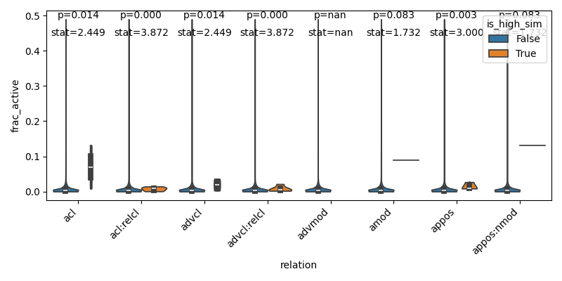

# Densely-activating SAE latents and linguistic features

This work is actively being developed, and the latest commit might not be the most recent stable version. Please check back periodically for updates.

## Background

Sparse autoencoders (SAEs; Bricken et al., 2023; Templeton et al., 2024) have emerged as a powerful tool for probing the representations learned by large language models (LLMs) by decomposing model activations (in the residual stream and elsewhere) into their constituent latent *features*. Such linguistic features are assumed to be *sparse*, leading to "superposition" — the tendency for models to represent more features than they have dimensions (Elhage et al., 2022). However, SAEs struggle to capture features with different levels of abstraction, and it is often not clear how to best select the number of SAE latents to use (Bussmann et al., 2024). Empirically, it is also the case that certain SAE latents are sometimes active on a very high fraction (> 5%) of tokens ("activation density"), especially in JumpReLU (Rajamanoharan et al., 2024) and TopK (Gao et al., 2024) SAEs, which runs counter to the sparse feature intuition (Nanda, 2025).

This repo makes several contributions to this literature surrounding SAEs, focusing on Google's [Gemma-2-2B model](https://huggingface.co/google/gemma-2-2b).

1. We show that a subset of densely-activating latents correspond to highly structured linguistic features. Such latents are often misinterpreted by existing autointerp pipelines (e.g. [Neuronpedia's Gemma Scope](https://www.neuronpedia.org/gemma-scope#main) (Lieberum et al., 2024) and to our knowledge, have not been previously reported. However, more recent autointerp prompting methods (e.g. Juang et al., 2024) with SOTA models show better results interpreting these latents.

2. We show that [Matryoshka SAEs](https://github.com/bartbussmann/matryoshka_sae) (Bussmann et al., 2024; Nabeshima, 2024) better isolate these linguistic features. More specifically,latents with high cosine similarity to linguistic features are even more likely to be densely-activating in these Matryoshka SAEs, compared to "vanilla" JumpReLU SAEs. Conversely, there are fewer "uninterpretable" densely-activating latents in Matryoshka SAEs.

## Approach

When browsing the [Neuronpedia](https://www.neuronpedia.org/gemma-scope#main) dashboards of densely-activating latents, we noticed that while many latents were difficult for humans to interpret, a subset appeared to correspond quite well with linguistic features (based on their max-activating tokens), despite being mislabeled by Neuronpedia's autointerp description. For example, [here's](https://www.neuronpedia.org/gemma-2-2b/5-gemmascope-res-16k/11910?embed=true&embedexplanation=true&embedplots=true&embedtest=true) a latent that seems to fire selectively on adjectival modifiers (`amod` relation):

To study this phenomenon in a more structured way, we first trained linear probes for Universal Dependencies based on the [UD_English-EWT dataset](https://github.com/UniversalDependencies/UD_English-EWT). [Universal Dependencies](https://universaldependencies.org/) is a framework for consistent annotation of grammar (including syntactic dependencies) across different human languages. These dependencies are in some sense the most basic elements from which more elaborate relational composition (Wattenberg & Viégas, 2024) can be realized. Classic work in NLP has demonstrated that transformers are able to not only learn these dependencies (Tenney et al., 2019a, 2019b), but also assemble them into more structured, low-dimensional representations (Hewitt & Manning, 2019; Diego-Simón et al., 2024). Our probes (linear layers trained with a binary cross-entropy loss on multi-class classification) replicate these earlier findings.

Next, we computed the cosine similarity between these probe weights and the pre-trained Gemma Scope JumpReLU SAE latents (width 16k) and computed the max cosine similarity for each relation type. We then compared this to the distribution of max cosine similarity values for randomly permuted SAE encoder weights and found highly significant degrees of alignment, particularly in layers 3-6.

We split the SAE latents into two groups: one showing high alignment with probe weights (`cosine_sim > 0.1`), and one showing low alignment. We then computed the activation density of each group, and found that the high-alignment group had consistently higher activation density than the low-alignment group across dependency relation types.

We performed the same analyses for Matryoshka SAEs, and found similar results. If anything, cosine similarities are generally even higher for Matryoshka SAEs, and activation densities are also higher within this high-alignment group.

## Conclusion

While still a work in progress, this repo provides a simple framework for studying the relationship between SAE latents and linguistic features. We hope it will be useful for future work in this area.
